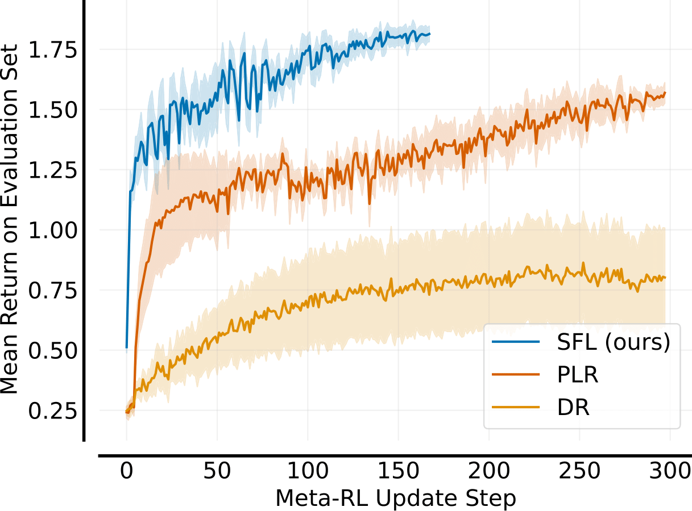
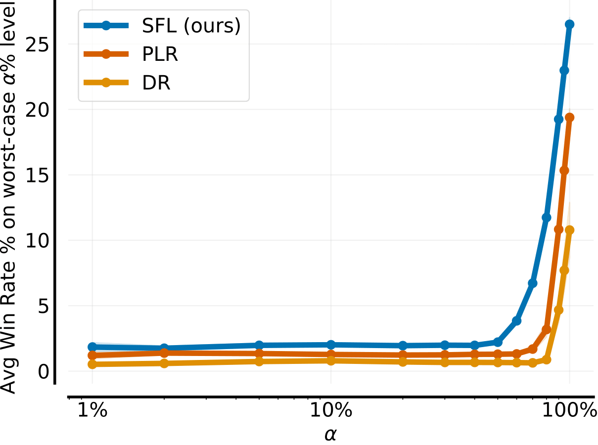

# SFL - XLand-MiniGrid 

Fork of [XLand-MiniGrid](https://github.com/corl-team/xland-minigrid) for "No Regrets: Investigating and Improving Regret
Approximations for Curriculum Discovery". This repository is seperate from the [main paper repository](https://github.com/amacrutherford/sampling-for-learnability) due to XLand having a different JAX version from JaxNav and JaxUED's Minigrid.

<div class="collage">
    <div class="column" align="centre">
        <div class="row" align="centre">
            
            
        </div>
    </div>
</div>


## Installation

We include a Dockerfile which can be built with `make build` and run with `make run`.

## Running experiments

All training scripts are located within `training`. Experiments can be easily run with `wandb` sweeps, with example configuration files located within `sweeps`. We include a helpful script for easily starting sweeps, `start_wandb_sweep.py`. Using it, our sfl result can be recreated as:

```
python start_wandb_sweep.py sweeps/sfl_seeds.yaml 0:3 1
```

## CVaR Evaluation

Code for our robust evaluation is located within `eval`. 

## Citation 🙏

XLand-MiniGrid should be cited as:
```bibtex
@inproceedings{
    nikulin2023xlandminigrid,
    title={{XL}and-MiniGrid: Scalable Meta-Reinforcement Learning Environments in {JAX}},
    author={Alexander Nikulin and Vladislav Kurenkov and Ilya Zisman and Viacheslav Sinii and Artem Agarkov and Sergey Kolesnikov},
    booktitle={Intrinsically-Motivated and Open-Ended Learning Workshop, NeurIPS2023},
    year={2023},
    url={https://openreview.net/forum?id=xALDC4aHGz}
}
```

SFL should be cited as:
```bibtex
TODO
```
